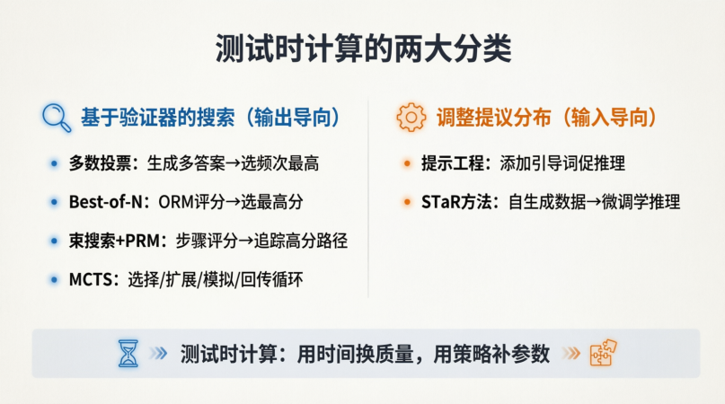

# 第一章 测试时计算
1. 推理模型：
``` 
学会如何从多步思考中获得更优的答案（这个过程称为推理）
```
2. 训练时计算和测试时计算
```
训练时计算：在训练阶段投入大量算力，把能力提前学进参数。（提前学会）
测试时计算：推理阶段多花计算，让模型现场思考。（现场思考）

重点1 ：test-time compute 本身不会产生智能，模型是否学会“如何利用额外计算”

训练阶段
↓
学会如何思考
↓
推理阶段
↓
使用更多计算展开思考
重点2: test-time compute 是“多思考” reasoning model 是“会思考” 前者是资源。后者是能有效利用这种资源的模型。
```
3. 测试时计算的分类


# 第二章 架构设计

1. RMSNorm
**RMSNorm**（Root Mean Square Layer Normalization）是 LayerNorm 的一种简化变体，由论文 *Root Mean Square Layer Normalization* (Biao Zhang, Rico Sennrich, 2019) 提出。其核心思想是 **只做缩放（scale），不做平移（shift）**，从而降低计算开销。
**核心公式：**
对于输入向量 \( x \in \mathbb{R}^{d} \)：
 **计算 RMS（均方根）**  
   \[
   \text{RMS}(x) = \sqrt{\frac{1}{d} \sum_{i=1}^{d} x_i^2 + \epsilon}
   \]
   （\(\epsilon\) 为防止除零的小常数）
 **归一化（只除以 RMS）**  
   \[
   \bar{x} = \frac{x}{\text{RMS}(x)}
   \]
 **可学习的缩放（gain）**  
   \[
   y = \gamma \odot \bar{x}
   \]
   其中 \(\gamma \in \mathbb{R}^{d}\) 是训练中学习的增益参数。
**与 LayerNorm 的关键区别：**
- LayerNorm：先减去均值（中心化），再除以标准差，最后做 **缩放 + 平移**（\(\gamma \cdot x + \beta\)）。
- RMSNorm：**不做中心化，没有平移参数 \(\beta\)**。
**为什么去掉均值？**
- 均值中心化在某些深度网络（尤其是 Transformer）中并非必需，其作用可以被残差连接或后续权重吸收。
- 减少计算量（约 10%~30%），无需计算均值和均值差分。
- 在实践中（如 LLaMA、Gemma 等大模型）效果与 LayerNorm 相近甚至更好。
**与layerNorm相比，优势是什么？**
- 计算简单，不用计算均值。
- 参数更少。
- 与layerNorm效果相当或更优。
2. MLA https://spaces.ac.cn/archives/10091

3. SWIGLU https://blog.csdn.net/qq_45791939/article/details/146206640
